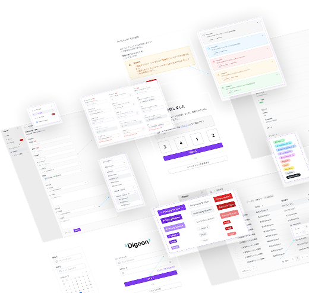

# MinIOとS3をローカルで切り替える｜積み木開発テンプレート改善事例

こんにちは。株式会社Digeonでエンジニアをしている坂下です。

Digeonでは「積み木開発」という独自の開発手法を採用しています。これは、再利用可能な部品（コンポーネント）を積み木のように組み合わせていくことで、効率的かつ高品質なソフトウェアを開発するアプローチです。


> ※積み木開発の詳細については[こちらの記事](https://note.com/digeon/n/ne4c6d6f00b29)をご覧ください。

弊社では新しいプロジェクトを始める際、あらかじめ用意された「積み木開発テンプレートリポジトリ」をフォークしてスタートします。
テンプレートは、次のプロジェクトでよりスムーズに開発を始められるよう常にアップデートを重ねています。

今回はその改善の一環として、**ローカル環境でMinIOとAmazon S3を自由に切り替えて利用できる機能**を追加しました。
この記事では、その背景と仕組み、そして導入後の効果について紹介します。

---

## 取り組みの背景と概要

これまで、ローカル開発環境でファイルアップロード機能をテストする際は、AWS上にS3バケットを用意し、アクセスキーを発行して接続する必要がありました。
この作業自体はそれほど時間がかかるものではありませんが、地味に面倒なため、必要になるまで後回しにしてしまうことも少なくありません。

さらに、セキュリティの観点からAWSの権限を持つメンバーは当然限られているため、開発者がテストする度に「アクセスキーください」というやり取りも発生します。
発行する側もされる側も面倒なため、とりあえず動くだろうしローカルテストなしでマージしてやろうかと思ってしまったりも...笑

この煩わしさをなくすために、開発環境の初期セットアップ時にMinIO用のコンテナを立ち上げて、即座にファイルのローカル保存・再アクセスができる状態で開発をスタートしよう！と思い立ったのが今回の改善のきっかけです。

---

## 環境変数でS3とMinIOをワンタッチ切り替え

MinIOは、AWS S3とAPI互換を持つオープンソースのオブジェクトストレージです。
オンプレミス環境やローカル開発、CI環境などでも簡単にS3互換ストレージを立てられるため、テスト用途などでよく利用されます。

[MinIO公式サイト](https://www.min.io/)

### ストレージの切り替えフラグ
以下のように、アプリケーションのストレージ接続先を切り替えるフラグを環境変数に持たせました。

```bash
# ストレージの切り替えフラグ
IS_ON_PREMISE_STORAGE=true  # true: MinIO / false: AWS S3

# 共通のS3互換ストレージ設定
AWS_ACCESS_KEY_ID=your_access_key
AWS_SECRET_ACCESS_KEY=your_secret_key
AWS_REGION=ap-northeast-1
S3_BUCKET=sample
FORCE_PATH_STYLE=true

# MinIO環境用のエンドポイント設定
MINIO_ENDPOINT=http://minio:9000
MINIO_PRESIGN_ENDPOINT=http://localhost:9000
```

アプリケーションはこれを読んで、自動的にS3クライアントまたはMinIOクライアントを選択します。

ローカルからS3へ接続したい場合は、アクセスキー等を設定した上でフラグを切り替えればOKです。プロダクション環境でも同じコードがS3へ接続するため、環境ごとの差異を気にせず開発できるようになっています。

## docker-composeでMinIOを自動起動する

開発用のdocker-composeにMinIOのサービスを定義しています。
MinIOサーバーはS3 API用をポート9000、Webコンソール用を9001で動作させています。
同時に、MinIO Client（`mc`）が初回起動時に`sample`バケットを自動作成するようにしています。

```yaml
minio:
  image: minio/minio:RELEASE.2024-07-29T22-14-52Z
  ports:
    - "9000:9000"        # S3 API
    - "9001:9001"        # Console
  environment: # 仮
    - MINIO_ROOT_USER=root
    - MINIO_ROOT_PASSWORD=password
  command: server /data --address :9000 --console-address :9001
  volumes:
    - ./minio/data:/data

mc:
  image: minio/mc:RELEASE.2023-12-23T08-47-21Z
  depends_on:
    - minio
  entrypoint: >
    /bin/sh -c "
    mc alias set myminio http://minio:9000 root password;
    mc mb myminio/sample;
    "
```

`docker compose up`を実行すれば、自動的にMinIOが起動し、ローカルですぐに利用できるようになっています。
ブラウザから `http://localhost:9001` にアクセスすれば、Webコンソールでオブジェクトの状態を確認することもできます。

---

## モック削減で自動テストの信頼性を高める

（こちらは約1年前ほど前から導入済みでしたが、ついでにご紹介します）

署名付きURL発行のエンドポイントについて、これまではS3へのアクセス部分をMock化して自動テストを行っていました。
この部分をMinIOに差し替え、より本番環境に近い形でテストできるようにしました。

署名付きURL発行エンドポイントは、処理の大半が実オブジェクトの操作部分です。そのため、実オブジェクト操作をモックしたテストは、プロダクト全体の品質保証という観点からあまり価値のあるものとは言えませんでした。

MinIOを利用したテストでは、実際にオブジェクトPUT／GET用の署名付きURLを発行する処理を通して検証できるようになりました。これにより、実際のストレージAPIを使った署名生成フローを本番とほぼ同等の環境で確認できます。
価値の低いモックコードを減らしつつ、より信頼性の高いテスト環境を整備することができました。

テストコードもプロダクトの一部であり、価値の低いコードは純粋に技術的負債です。また、Mockテストが通っているのに本番環境で事故が起きるような実装も、同じく負債といえます。
今回の改善は、そうした見かけの安心を減らし、コードベースの実質的な信頼性を高めることに繋がったと感じています。

---

## 開発効率とストレス軽減、小さな改善を積み重ねる

正直、この変更単体で開発体験が劇的に向上したわけではありません。
それでも、毎回S3環境を用意する手間がなくなり、開発者がファイル機能をすぐに試せるようになったことで、日々のストレスが1つ確実に減りました。

Digeonでは複数プロジェクトを同時に進めることが多く、テンプレートを使う人数も増えています。
この小さなストレス解消が、**開発者×プロジェクト数分**積み上がることで、長期的に見れば大きな生産性向上につながったのではないかと思います。

---

## まとめ：より効率的で、質の高い開発へ

Digeonでは今後も「高品質なソフトウェアを爆速で提供する」ために、テンプレートの改善や積み木開発の推進を続けていきます。
こうした小さな工夫の積み重ねこそが、エンジニアリング文化を育てる最良の手段だと考えています。

---
